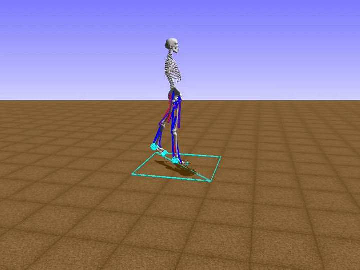

# mas-project-burov-ay2122

## Learning to walk around [MAS Course Project ay2122]

This is the repo containing code for training, deploying and validating. 
The project aims to solve the [task of walking around](http://osim-rl.kidzinski.com/docs/nips2019/) as a multiagent system task.
As a baseline approach DreamerV1 was chosen.

<table>
  <tr>
    <td> </td>
    <td></td>
   </tr> 
</table>

## Installing the environment
Prerequesties: 
```
conda >= 5.3.1 # (python 3.6)
mpi4py >=3.1.0
```
To install the environment use the next command from the project directory: 
```
cd BaseImage
conda env create -f environment.yml
```
This should create the environment with all packages installed. Some problems might occur with particular machine.

## Training
There are several ways to train models - single and multiprocess. 
To train in a single process mode do following steps:
```
conda activate opensim-rl
python train_dreamer_single_thread.py
```
Configuration of hyperparameters and training environment is done via ```config.py``` file. 

To train in a multipocess mode it is recommended to use prebuilt docker container. To train with docker container do following steps:
```
docker pull naburov/mas-project-burov-ay2122
docker run {mount arguments} --gpus 0  naburov/mas-project-burov-ay2122 /bin/bash -c "source activate opensim-rl;export LD_LIBRARY_PATH=/usr/local/cuda-10.2/lib64${LD_LIBRARY_PATH:+:${LD_LIBRARY_PATH}};mpirun -np {n_processes} --allow-run-as-root python  train_dreamer_non_block.py"
```
To train in a multipocess mode on your own machine you should execute:
```
mpirun -np 20 --allow-run-as-root python train_dreamer_non_block.py
```
Problem with local training is MPI compatibility as it is OS and hardware dependent. Here I'm not going to explain how to build MPI for your own system. Refer to: [linux](https://www.open-mpi.org/faq/?category=building#easy-build), [windows](https://docs.microsoft.com/en-us/message-passing-interface/microsoft-mpi)


## Validating
To check the perfomance of the model you should:
1. Download final weights from [google drive folder](https://drive.google.com/drive/folders/15l626Dfau1rahLc7OHhJlFwEt2K5pqyL?usp=sharing) and store them to the single directory *dirname*
2. Edit config file. Set MODEL_CHECKPOINT_DIR to the absolute path of the folder with checkpoints
3. From the project directory run: ```python validate_dreamer.py ```